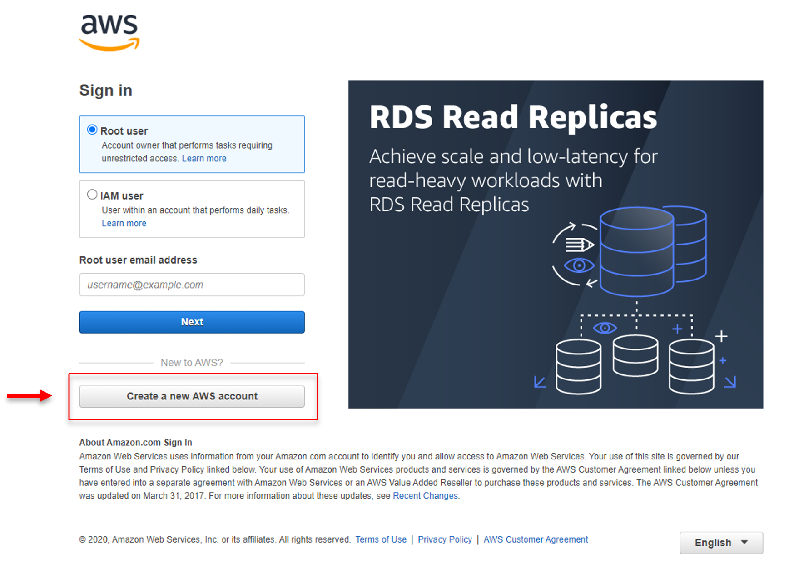
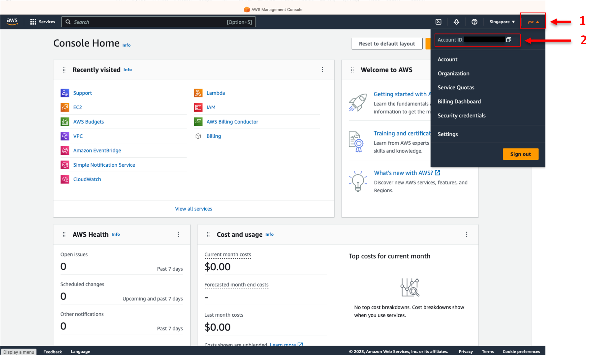
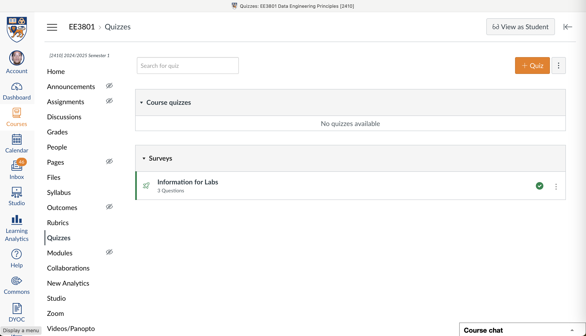
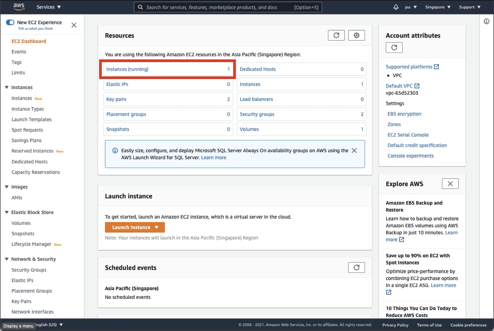
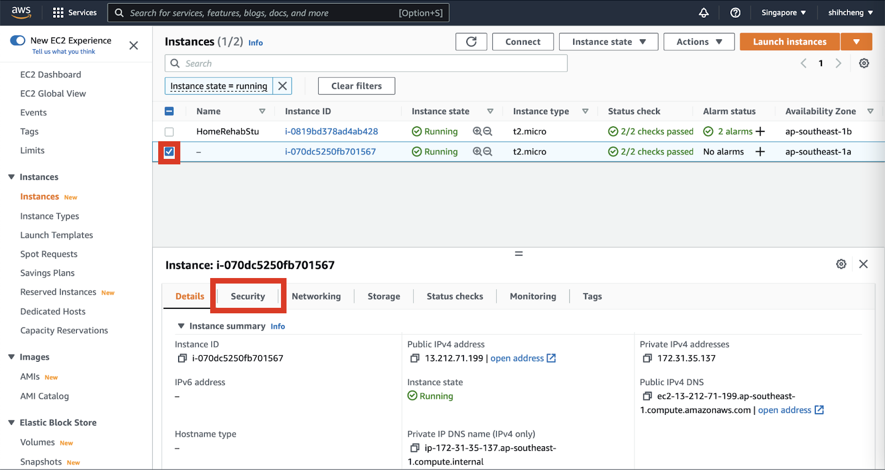
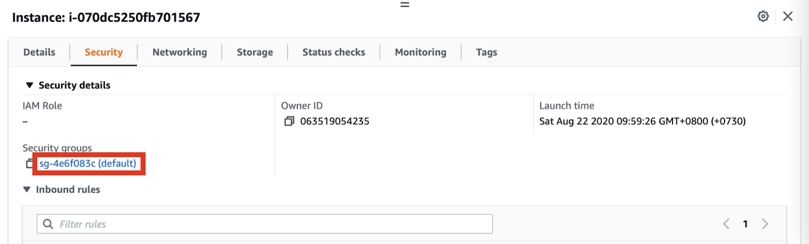
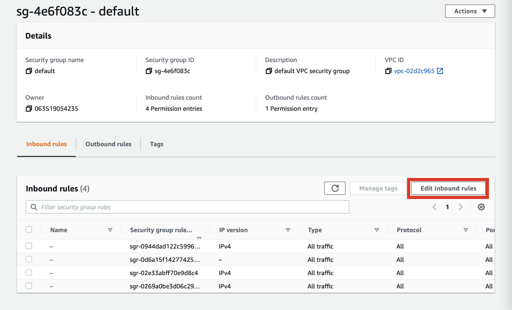
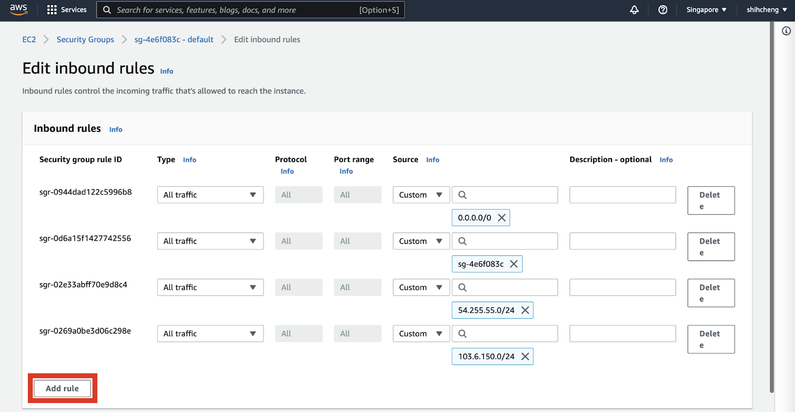
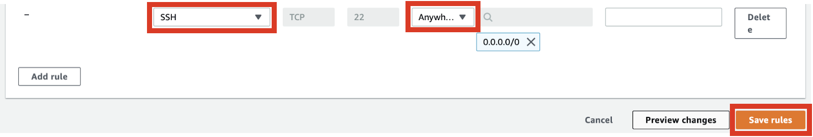

# Part 1. Create your AWS account

## 1. 
In order for us to pay for your AWS charges, create an AWS account **using your NUS email address** at:

https://console.aws.amazon.com/console/home?nc2=h_ct&src=header-signin



Enter your payment information when prompted. If you follow the instructions in this course carefully, you should not incur any charges.

## 2. 
Once you have logged into your newly created account, get your account number from the AWS Management Console by clicking your username in the top right:



> <p class="task"> Task
>
> Submit your account number to the Canvas Ungraded Survey (under Quizzes) named "Information for Labs", along with the kind of computer you will be using to complete the labs (e.g. Windows, Mac, Linux), and the NUS email address you used to create your AWS account:
> 
> 
>
> This will allow us to invite you to our AWS Organization, which will cover the charges you incur while working on the labs. Do look out for the invitation and accept it in order to added to our AWS Organization.
>
> In addition, we will use the kind of computer you will be using to group you up with TAs that have experience using the same type of computer.

## 3. 
Next, you will need to create an access key by going to your AWS Console and selecting your username in the top right to reveal the drop-down menu, and then select “Security credentials”. You can then select the “Access keys (access key ID and secret access key)” drop-down menu and click the “Create New Access Key” button. Click the "Download .csv file” button to download a CSV file containing your access key. Take note of where you saved this file as you will need it in the next part of the lab.

Leave your Console open in your browser as you will need to use it again later in the lab.

# Part 2. Install the AWS Command Line Interface (CLI)

## 4. 

Although the AWS Management Console makes it easy to get started, we will need to use the command line interface to set up automation for our data pipelines. Follow the instructions here to install the AWS CLI:

https://docs.aws.amazon.com/cli/latest/userguide/getting-started-install.html

> <p class="warn"> For Mac users, you can follow the instructions for the GUI installer.

> <p class="warn"> For Linux users, you can follow the instructions for the command line installer for x86 or ARM depending on what processor architecture your laptop is using.

## 5.

Once the software has been installed, open a Terminal and type the following:

```bash
aws configure
```

> <p class="warn"> For Windows users, make sure you are using the Ubuntu shell:
> 
> https://learn.microsoft.com/en-us/windows/terminal/

When prompted, use “ap-southeast-1” for region, "json" for output format, and enter the Key ID and Secret Key from the CSV above. 

## 6.

Run the following to create a key pair in your home directory (make sure the following command is entered in one line):

```bash
aws ec2 create-key-pair --key-name MyKeyPair --query 'KeyMaterial' --output text > MyKeyPair.pem
```

The ">" symbol indicates that the output of the aws command should be saved into the "MyKeyPair.pem" file in the current directory. We will be learning more about commands like this in subsequent labs.

Change the permissions on your private key file so you can connect to AWS:

```bash
chmod 400 MyKeyPair.pem
```

# Part 3. Start an AWS EC2 Instance

## 7. 

Run the following to start up a Linux-based t2.micro EC2 instance:

```bash
aws ec2 run-instances --image-id resolve:ssm:/aws/service/ami-amazon-linux-latest/amzn2-ami-hvm-x86_64-gp2 --instance-type t2.micro --key-name MyKeyPair
```

You can learn about the different instance types (including t2.micro) at:

https://aws.amazon.com/ec2/instance-types/

> <p class="task"> Task
>
> Take a screenshot of your Terminal window showing the command and the corresponding output and include it in your lab report.

## 8. 

Get the IP address of the EC2 instance using the following command:

```bash
aws ec2 describe-instances --filter "Name=instance-type,Values=t2.micro" --query "Reservations[].Instances[].PublicIpAddress"
```

> <p class="task"> Task
>
> Take a screenshot of your Terminal window showing the command and the corresponding output and include it in your lab report.

# Part 4. Use your EC2 Instance

## 9. 

Copy a file to your EC2 instance using the secure copy command "scp" (replace "<ip_address>" below with the IP address you obtained above):

```bash
scp -i MyKeyPair.pem MyKeyPair.pem ec2-user@<ip_address>:~/
```

You can find out more about the scp syntax at:

https://linuxize.com/post/how-to-use-scp-command-to-securely-transfer-files/

If you encounter an error, follow the instructions in Step 11 before retrying this step.

Login to your EC2 instance:

```bash
ssh -i MyKeyPair.pem ec2-user@<ip_address> 
```

List the files in the home directory of your EC2 instance (the IP address in the prompt below should be different from the one shown):

```bash
[ec2-user@ip-10-0-5-43 ~]$ ls
```

You should see the file MyKeyPair.pem that you copied to your EC2 instance earlier in the file listing.

Logout from your EC2 instance:

```bash
[ec2-user@ip-10-0-5-43 ~]$ exit
```

You can also type “Control-d” to logout.

> <p class="task"> Task
>
> Take a screenshot of your Terminal window showing the commands above and the corresponding output and include it in your lab report.

# Part 5. Shut down your EC2 Instance

## 10. 

In order to terminate the EC2 instance, first get the Instance ID:

```bash
aws ec2 describe-instances --filter "Name=instance-type,Values=t2.micro" --query "Reservations[].Instances[].InstanceId"
```

Then run the following command to terminate the instance (replace "<ids_here>" with the Instance ID you obtained above):

```bash
aws ec2 terminate-instances --instance-ids <ids_here>
```

Verify that there are no EC2 instances running:

```bash
aws ec2 describe-instances --filter "Name=instance-type,Values=t2.micro" --query "Reservations[].Instances[].PublicIpAddress"
```

> <p class="task"> Task
>
> Take a screenshot of your Terminal window showing the commands above and the corresponding output and include it in your lab report.

## 11. 

If you are having problems with SSH access to your EC2 instance, go back to your browser, and click on “Instances (running)” in your EC2 Dashboard:



Select the checkbox for your instance and click on the “Security” tab:
:



Select the default Security groups:



Click on “Edit inbound rules” (ignore the fact that there are multiple rules present in the screenshot below):



Click on “Add rule”:



Select “SSH” under “Type” and “Anywhere IPv4” under “Source”, and then click the “Save rules” button.



This should resolve your SSH access issues.
