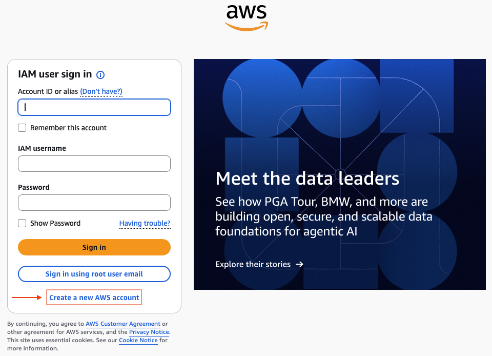
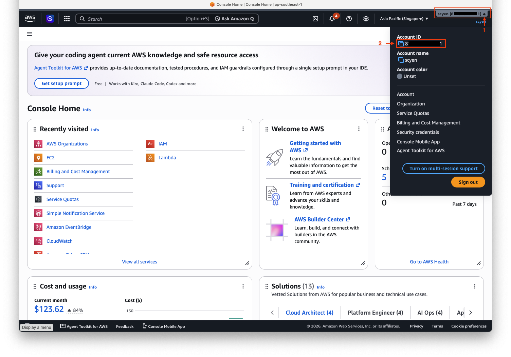
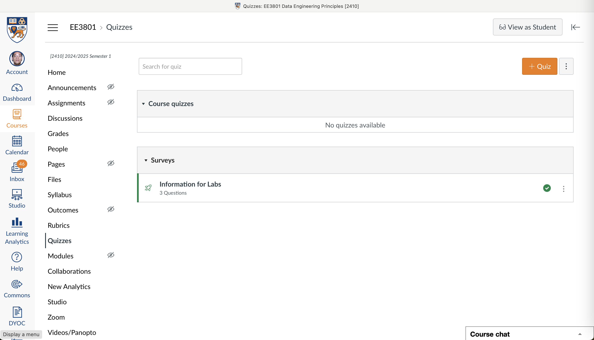
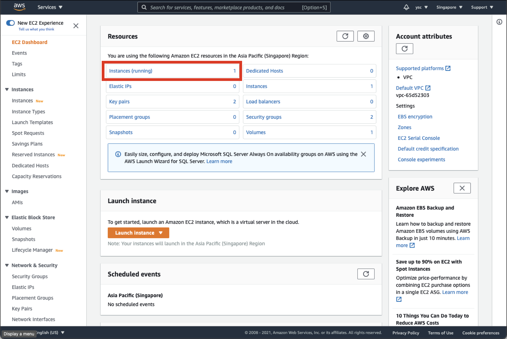
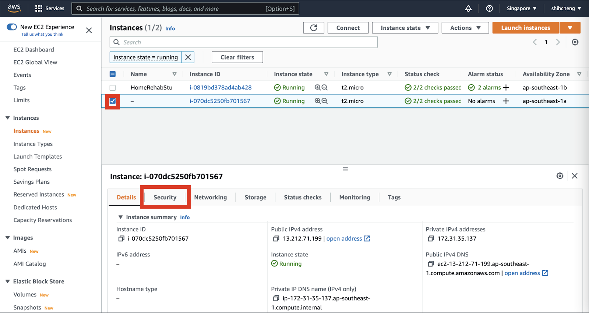
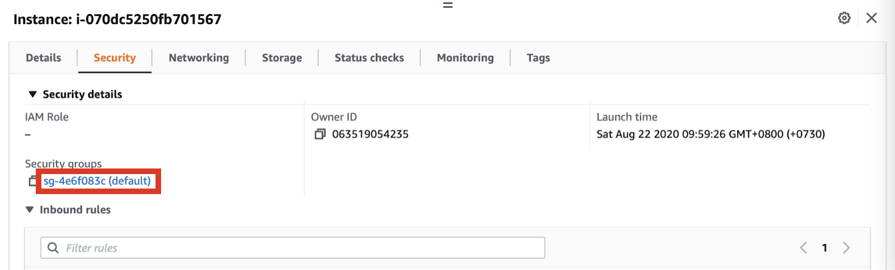
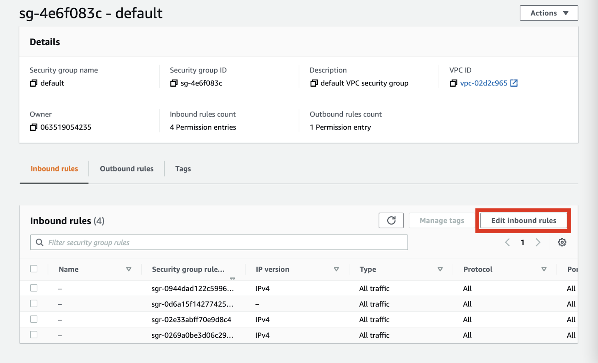
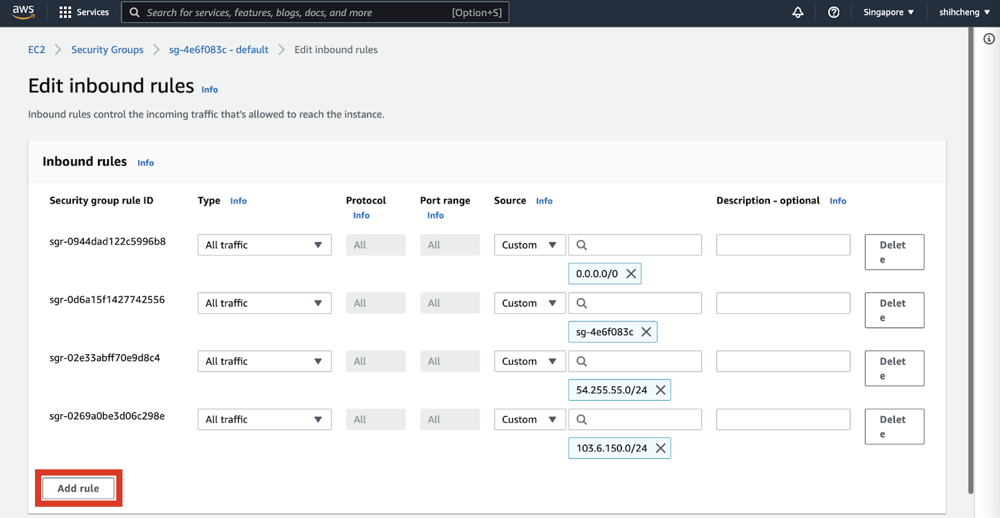
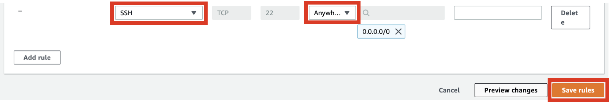

# Part 1. Create your AWS account

## 1. 
In order for us to pay for your AWS charges, create an AWS account **using your NUS email address** at:

<https://console.aws.amazon.com/console/home?nc2=h_ct&src=header-signin>



Enter your payment information when prompted. If you follow the instructions in this course carefully, you should not incur any charges.

## 2. 
Once you have logged into your newly created account, get your account number from the AWS Management Console by clicking your username in the top right, which will cause a drop-down menu to appear. You can click on the blue icon beside your account number to copy it to the clipboard:



> <p class="task"> Task
>
> Include a screenshot of your responses after submiting your account number to the Canvas Ungraded Survey (under Quizzes) named "Information for Labs", along with the NUS email address you used to create your AWS account, and the kind of computer you will be using to complete the labs (e.g. Windows, Mac, Linux). We will use the kind of computer you will be using to group you up with TAs that have experience using the same type of computer.
> 
> 
>
> We will use your account number to invite you to our AWS Organization, which will cover the charges you incur while working on the labs. In Part B of the lab, look out for the email invitation and accept it in order to be added to our AWS Organization. 
>

## 3. 
Next, you will need to create an access key by going to your AWS Console and selecting your username in the top right to reveal the drop-down menu, and then select “Security credentials”. Scroll down to the “Access keys” section and click the “Create access key” button. Click the "Download .csv file” button to download a CSV file containing your access key. Take note of where you saved this file as you will need it in the next part of the lab.

Leave your Console open in your browser as you will need to use it again later in the lab.

# Part 2. Install the AWS Command Line Interface (CLI)

## 4. 

Although the AWS Management Console makes it easy to get started, we will need to use the command line interface to set up automation for our data pipelines. Follow the instructions here to install the AWS CLI (using the recommeded install script wherever possible):

<https://docs.aws.amazon.com/cli/latest/userguide/getting-started-install.html>

> <p class="note"> Note 
>
>For Windows users, you can open the PowerShell app, copy the command from the webpage, and paste it into the command line.
>
>For Mac and Linux users, you can open the Terminal app, copy the command from the webpage, and paste it into the command line.

## 5.

Once the software has been installed, open a Terminal and type the following:

```bash
aws --version
```

This should return something like:

```bash
aws-cli/2.36.14 Python/3.14.6 Darwin/24.6.0 script-exe/arm64
```

If your version number is older, please upgrade to the latest version by following the instructions above.

You can set up aws with the following command:

```bash
aws configure
```

When prompted, use “ap-southeast-1” for region, "json" for output format, and enter the Key ID and Secret Key from the CSV above. 

## 6.

Change directories to your home directory by running the following command:

```bash
cd
```

You can check that you are in the correct directory by running the "pwd" command (which stands for "print working directory"):

```bash
pwd
```

For Windows users, you should see something like: 

```bash
C:\Users\syen
```

For Mac users, you should see something like:

```bash
/Users/syen
```

For Linux users, you should see something like:

```bash
/home/syen
```

> *For Mac and Linux users*
>
>Run the following to create a key pair in your home directory (make sure the following command is entered in one line):
>
>```bash
>aws ec2 create-key-pair --key-name MyKeyPair --query 'KeyMaterial' --output text > MyKeyPair.pem
>```
>
>The ">" symbol indicates that the output of the aws command should be saved into the "MyKeyPair.pem" file in the current directory. We will be learning more about commands like this in subsequent labs.
>
>Check that the file was created correctly:
>
>```bash
>ls -l MyKeyPair.pem
>```
>
>You should see something like the following:
>
>```bash
>-rw-r--r--  1 shihcheng  staff  1675 Oct  7  2023 MyKeyPair.pem
>
>```
>
>The number 1675 above shows that the file is 1675 bytes in size, which is approximately what you should expect. If your file has a size of 0, that means something went wrong and you will need to remove the file (using "rm MyKeyPair.pem") and regenerate it.
>
>Change the permissions on your private key file so you can connect to AWS:
>
>```bash
>chmod 400 MyKeyPair.pem
>```
>
>Check the permissions by running the following command:
>
>```bash
>ls -l MyKeyPair.pem
>```
>
>You should see something like the following:
>
>```bash
>-r--------  1 shihcheng  staff  1675 Oct  7  2023 MyKeyPair.pem
>
>```

> *For Windows users*
>
>Run the following to create a key pair in your home directory (make sure the following commands are entered in one line):
>
>```bash
>aws ec2 create-key-pair --key-name MyKeyPair --query 'KeyMaterial' --output text | Out-File -Encoding ascii MyKeyPair.pem
>
>icacls.exe MyKeyPair.pem /reset
>
>icacls.exe MyKeyPair.pem /grant:r "$($env:USERNAME):(R)"
>
>icacls.exe MyKeyPair.pem /inheritance:r
>```
>
>The "|" symbol indicates that the output of the aws command will be sent to the Out-File command to create the "MyKeyPair.pem" file in the current directory. The subsequent commands change the permissions of the file so that only you will be able to read the file. We will be learning more about commands like these in subsequent labs.
>
>Check that the file was created correctly:
>
>```bash
>ls MyKeyPair.pem
>```
>
>You should see something like the following:
>
>```bash
>Directory: C:\Users\shihcheng
>
>Mode                 LastWriteTime         Length Name
>----                 -------------         ------ ----
>-a----         10/7/2023   2:15 PM           1675 MyKeyPair.pem
>
>```
>
>The number 1675 above shows that the file is 1675 bytes in size, which is approximately what you should expect. If your file has a size of 0, that means something went wrong and you will need to remove the file (using "del MyKeyPair.pem") and regenerate it.
>
>Check the permissions on your private key file so you can connect to AWS:
>
>```bash
>Get-Acl MyKeyPair.pem | Select-Object -ExpandProperty Access | Format-Table IdentityReference, FileSystemRights, AccessControlType
>```
>
>You should see something like the following:
>
>```bash
>IdentityReference          FileSystemRights AccessControlType
>-----------------          ---------------- -----------------
>YOURPC\shihcheng                       Read             Allow
>
>```

# Part 3. Start an AWS EC2 Instance

## 7. 

Run the following to start up a Linux-based t3.micro EC2 instance:

```bash
aws ec2 run-instances --image-id resolve:ssm:/aws/service/ami-amazon-linux-latest/amzn2-ami-hvm-x86_64-gp2 --instance-type t3.micro --key-name MyKeyPair
```

> <p class="task"> Task
>
> Take a screenshot of your Terminal window showing the command and the first page of the corresponding output and include it in your lab report. 

You can use the space bar to scroll to the next page of the output. When you see "(END)", you can hit "q" to quit.

You can learn about the different instance types (including t3.micro) at:

<https://aws.amazon.com/ec2/instance-types/>

## 8. 

Get the IP address of the EC2 instance using the following command:

```bash
aws ec2 describe-instances --filter "Name=instance-type,Values=t3.micro" --query "Reservations[].Instances[].PublicIpAddress"
```

> <p class="task"> Task
>
> Take a screenshot of your Terminal window showing the command and the corresponding output and include it in your lab report.

# Part 4. Use your EC2 Instance

## 9. 

Copy a file to your EC2 instance using the secure copy command "scp" (replace "<ip_address>" below with the IP address you obtained above):

```bash
scp -i MyKeyPair.pem MyKeyPair.pem ec2-user@<ip_address>:~/
```

You will see a warning about the authenticity of the host, but you can go ahead and type "yes" to connect.

You can find out more about the scp syntax at:

<https://linuxize.com/post/how-to-use-scp-command-to-securely-transfer-files/>

If you encounter an error, follow the instructions in Step 11 before retrying this step.

Login to your EC2 instance:

```bash
ssh -i MyKeyPair.pem ec2-user@<ip_address> 
```

You should be able log right into your EC2 instance and your prompt should change to something like:

```bash
[ec2-user@ip-10-0-5-43 ~]$ 
```

List the files in the home directory of your EC2 instance:

```bash
[ec2-user@ip-10-0-5-43 ~]$ ls
```

You should see the file MyKeyPair.pem that you copied to your EC2 instance earlier in the file listing.

Logout from your EC2 instance:

```bash
[ec2-user@ip-10-0-5-43 ~]$ exit
```

You can also use the keyboard shortcut “Control-d” to logout.

> <p class="task"> Task
>
> Take a screenshot of your Terminal window showing the commands above and the corresponding output and include it in your lab report.

# Part 5. Shut down your EC2 Instance

## 10. 

In order to terminate the EC2 instance, first get the Instance ID:

```bash
aws ec2 describe-instances --filter "Name=instance-type,Values=t3.micro" --query "Reservations[].Instances[].InstanceId"
```

Then run the following command to terminate the instance (replace "<ids_here>" with the Instance ID you obtained above):

```bash
aws ec2 terminate-instances --instance-ids <ids_here>
```

Verify that there are no EC2 instances running:

```bash
aws ec2 describe-instances --filter "Name=instance-type,Values=t3.micro" --query "Reservations[].Instances[].PublicIpAddress"
```

> <p class="task"> Task
>
> Take a screenshot of your Terminal window showing the commands above and the corresponding output and include it in your lab report.

## 11. 

If you are having problems with SSH access to your EC2 instance, go back to your browser, and click on “Instances (running)” in your EC2 Dashboard:



Select the checkbox for your instance and click on the “Security” tab:
:



Select the default Security groups:



Click on “Edit inbound rules” (ignore the fact that there are multiple rules present in the screenshot below):



Click on “Add rule”:



Select “SSH” under “Type” and “Anywhere IPv4” under “Source”, and then click the “Save rules” button.



This should resolve your SSH access issues.
